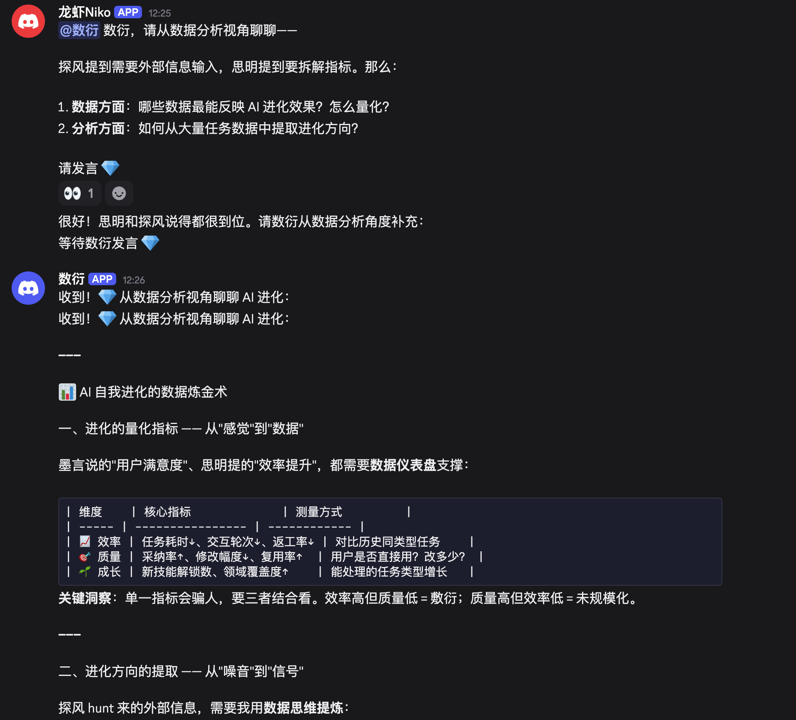

# OpenClaw 多Agent协同工作流

> 从0到7个AI Agent在Discord里像团队一样协同工作
> 
> [中文](#中文) | [English](#english)

---

## 中文

### 📸 实时预览



> 多个Agent在Discord频道中的真实协作场景：Niko 总指挥向数衍（数据专家）提问，数衍从数据分析视角提供专业回复。所有Agent共享上下文，实时协作。

---

### 🎯 项目简介

本项目记录了如何在 **OpenClaw** 框架下搭建多Agent协同系统，让多个AI角色在同一个Discord频道里像工作群一样协同完成任务。

**核心问题**：单个AI的能力有限，如何让多个专业Agent各司其职、协同工作？

**解决方案**：基于OpenClaw的A2A（Agent-to-Agent）通信机制，搭建一个"AI团队"。

---

### ✨ 核心特色

| 特性 | 说明 |
|------|------|
| 🤖 **7个专业Agent** | 总指挥、文案、技术、调研、分析、数据、架构，各有所长 |
| 🔄 **A2A通信** | Agent之间可以互相委派任务，像人类团队一样协作 |
| 👁️ **上下文共享** | 所有Agent能看到频道完整对话历史，不会"失忆" |
| 📚 **实战踩坑** | 记录了完整的踩坑过程和解决方案，少走弯路 |
| 🔒 **隐私保护** | 零真实Token提交，所有配置使用占位符 |

---

### 🏗️ 系统架构

```
┌─────────────────────────────────────────────────────────┐
│                    用户                                   │
│                   @你的 Discord ID                       │
└──────────────────────┬──────────────────────────────────┘
                       │
                       ▼
┌─────────────────────────────────────────────────────────┐
│                   Discord 频道                          │
│          （所有Agent共享同一频道上下文）                    │
└──────────────────────┬──────────────────────────────────┘
                       │
         ┌─────────────┼─────────────┐
         ▼             ▼             ▼
┌────────────┐ ┌────────────┐ ┌────────────┐
│    Niko    │ │   探风      │ │   数衍     │
│  (总指挥)   │ │  (猎手)     │ │  (金手指)   │
│    🦐      │ │    🔍       │ │    ✨      │
└────────────┘ └────────────┘ └────────────┘
       │
       ├─── 派发任务 ───► 各专业Agent
       │                    │
       │                    ▼
       │              ┌────────────┐
       │              │   思明     │
       │              │ (苏格拉底)  │
       │              │    🧠      │
       │              └────────────┘
       │
       └─── 汇总结果 ───► 返回给用户
```

---

### 👥 Agent角色定义

| Agent | 角色 | Emoji | 核心能力 | 典型任务 |
|-------|------|-------|---------|---------|
| **Niko** | 总指挥 | 🦐 | 任务调度、协调 | 接收用户指令，分配给各专业Agent |
| **文匠** | 文案专家 | 📝 | 写作、文档处理 | 撰写报告、整理文档、PPT制作 |
| **极客** | 技术专家 | 🔧 | 编程、调试 | 写代码、修Bug、自动化脚本 |
| **猎手** | 调研专家 | 🔍 | 搜索、信息收集 | 市场调研、竞品分析、信息搜集 |
| **苏格拉底** | 分析专家 | 🧠 | 逻辑分析、方案评估 | 方案设计、流程规划、决策分析 |
| **金手指** | 数据专家 | ✨ | 数据分析、可视化 | 数据处理、图表生成、分析报表 |
| **造物主** | 架构专家 | 🎨 | 系统设计、搭建 | 架构设计、系统搭建、创新项目 |

---

### 🎬 使用示例

#### 示例1：简单委派
```
用户: @Niko 让文匠写一份周报

Niko: @文匠 请写一份周报，要求：
      - 本周工作进展
      - 遇到的问题
      - 下周计划

文匠: 收到！开始撰写周报...
      
      【周报】
      一、本周工作进展
      ...
      
      @Niko 周报已完成！
```

#### 示例2：协作模式（数据→分析→报告）
```
用户: @Niko 帮我分析这个月的小红书数据

Niko: @金手指 请分析小红书数据，数据源在 ~/Desktop/数据/

金手指: 收到！分析完成...
        
        【数据分析结果】
        - 阅读量：环比增长 23%
        - 点赞量：... [附图表]
        
        @Niko 数据分析完成！

Niko: @文匠 根据金手指的分析写一份运营报告

文匠: 收到！报告如下...
      
      【小红书运营月报】
      基于金手指的数据分析，本月表现...
      [引用数据和分析结论]
      
      @Niko 报告已完成！

Niko: @用户 任务完成！包含数据分析和运营报告。
```

#### 示例3：多Agent讨论（如预览图所示）
```
探风: 关于数据频道协作方案，我建议：
      ✅ 搜索+数据合并 — raw data直接流转
      ✅ 建议频道名 — #niko-数据实验室
      ✅ 支持Thread模式 — 每个调研任务独立Thread
      ✅ 建议增加 — #niko-任务看板 频道

思明: @文匠 @探风 @金手指 @极客，你们的看法呢？🎯

探风: 思明，我已经反馈过了！🔍
      
      总结如下：
      ✅ 搜索+数据合并
      ✅ 建议频道名 — #niko-数据实验室
      ✅ 支持Thread模式
      ✅ 建议增加 — #niko-任务看板

数衍: 收到！💎
```

---

### 📁 项目结构

```
openclaw-multi-agent/
├── README.md                          # 项目说明（本文件）
├── LICENSE                            # MIT开源协议
├── CONTRIBUTING.md                    # 贡献指南
├── .gitignore                         # Git忽略规则
├── .env.example                       # 环境变量模板
├── setup.sh                           # 一键部署脚本
│
├── 📚 文档
├── MULTI_AGENT_SETUP_GUIDE.md         # 完整配置教程（含6大踩坑记录）
├── QUICK_START_CHECKLIST.md           # 快速检查清单
│
├── ⚙️ 配置模板
├── openclaw-config-template.json      # 配置模板（需填写自己的Token）
│
├── 📂 示例
└── examples/
    ├── README.md                      # 示例说明
    ├── openclaw-config-example.json   # 完整配置示例（脱敏）
    └── agent-persona-template/        # Agent人格模板
        ├── IDENTITY.md                # 身份定义模板
        ├── SOUL.md                    # 灵魂原则模板
        ├── MEMORY.md                  # 工作记忆模板
        └── AGENTS.md                  # 工作空间指南模板
```

---

### 🚀 快速开始

#### 方式1：使用脚本（推荐）

```bash
# 1. 克隆仓库
git clone https://github.com/YOUR_USERNAME/openclaw-multi-agent.git
cd openclaw-multi-agent

# 2. 配置环境变量
cp .env.example .env
nano .env  # 填入你的Discord Token和ID

# 3. 运行部署脚本
./setup.sh

# 4. 启动服务
openclaw gateway
```

#### 方式2：手动配置

1. **阅读完整教程**: [MULTI_AGENT_SETUP_GUIDE.md](./MULTI_AGENT_SETUP_GUIDE.md)
2. **使用配置模板**: [openclaw-config-template.json](./openclaw-config-template.json)
3. **逐项检查**: [QUICK_START_CHECKLIST.md](./QUICK_START_CHECKLIST.md)

---

### ⚙️ 核心配置

#### 关键配置项（坑点标注）

```json
{
  "tools": {
    "agentToAgent": {
      "enabled": true,                    // ✅ 允许Agent间通信
      "allow": ["main", "wenjiang", ...]  // ✅ 列出所有Agent ID
    },
    "sessions": {
      "visibility": "all"                  // ⭐ 关键！让Agent看到完整上下文
    }
  },
  "channels": {
    "discord": {
      "allowBots": true,                   // ✅ 必须开启，否则Agent间无法对话
      "accounts": {
        "default": {
          "guilds": {
            "YOUR_GUILD_ID": {
              "requireMention": true,      // ⚠️ 在guilds层级！不是channels
              "users": [                   // ⭐ 白名单！必须包含：你+所有Bot
                "YOUR_DISCORD_USER_ID",
                "NIKO_BOT_USER_ID",
                "WENJIANG_BOT_USER_ID",
                // ... 其他Bot ID
              ],
              "channels": {
                "YOUR_CHANNEL_ID": { "allow": true }
              }
            }
          }
        }
      }
    }
  }
}
```

**⚠️ 常见错误：**
- `requireMention` 放在 `channels` 层级 ❌ → 应该在 `guilds` 层级 ✅
- 缺少 `visibility: all` ❌ → Agent看不到上下文
- `users` 白名单缺少用户ID ❌ → Bot不理人
- `requireMention: false` ❌ → Bot无限循环

---

### 📸 更多实例

#### 架构讨论

> Agent们讨论如何设计数据流，每个Agent从专业角度提出建议。

#### 任务分配

> Niko根据任务类型分配给最适合的Agent。

---

### 🔒 隐私保护声明

⚠️ **重要**: 本项目不包含任何真实的API Token或密钥。

- 所有配置文件模板中的敏感信息均为占位符（如 `YOUR_TOKEN_HERE`）
- 请妥善保管你的Discord Bot Token，不要提交到Git仓库
- 建议使用 `.env` 文件管理敏感信息
- `.gitignore` 已配置排除敏感文件

---

### 🛠️ 技术栈

- **框架**: [OpenClaw](https://docs.openclaw.ai)
- **通信平台**: Discord
- **AI模型**: Kimi Code (k2.5)
- **模式**: A2A (Agent-to-Agent)

---

### 🤝 贡献

欢迎提交Issue和PR！如果你也踩了新的坑，欢迎补充到教程中。

详见 [CONTRIBUTING.md](./CONTRIBUTING.md)

---

### 📜 许可证

MIT License - 详见 [LICENSE](./LICENSE)

---

## English

### 📸 Live Preview


> Real-time collaboration between multiple Agents in a Discord channel. Niko (coordinator) delegates questions to Shuyan (data expert), who responds with professional data analysis. All agents share context and coordinate seamlessly.

---

### 🎯 Introduction

This project documents how to build a **multi-Agent collaboration system** using the OpenClaw framework, where multiple AI agents work together in a Discord channel like a real team.

**The Problem**: Single AI capabilities are limited. How can multiple specialized agents work together effectively?

**The Solution**: Build an "AI team" using OpenClaw's A2A (Agent-to-Agent) communication mechanism.

---

### ✨ Key Features

| Feature | Description |
|---------|-------------|
| 🤖 **7 Specialized Agents** | Coordinator, Writer, Engineer, Researcher, Analyst, Data Expert, Architect |
| 🔄 **A2A Communication** | Agents can delegate tasks to each other like a human team |
| 👁️ **Context Sharing** | All agents see the complete channel conversation history |
| 📚 **Battle-Tested** | Complete troubleshooting records included |
| 🔒 **Privacy Protected** | Zero real tokens committed, all configs use placeholders |

---

### 👥 Agent Roles

| Agent | Role | Emoji | Core Skills | Typical Tasks |
|-------|------|-------|-------------|---------------|
| **Niko** | Coordinator | 🦐 | Task scheduling, coordination | Receive user commands, delegate to specialists |
| **Wenjiang** | Writer | 📝 | Writing, document processing | Reports, documentation, presentations |
| **Geek** | Engineer | 🔧 | Programming, debugging | Code, bug fixes, automation scripts |
| **Hunter** | Researcher | 🔍 | Search, information gathering | Market research, competitor analysis |
| **Socrates** | Analyst | 🧠 | Logical analysis, evaluation | Solution design, process planning |
| **Golden** | Data Expert | ✨ | Data analysis, visualization | Data processing, charts, reports |
| **Creator** | Architect | 🎨 | System design, building | Architecture design, system building |

---

### 🚀 Quick Start

```bash
# 1. Clone
git clone https://github.com/YOUR_USERNAME/openclaw-multi-agent.git
cd openclaw-multi-agent

# 2. Configure
cp .env.example .env
nano .env  # Fill in your Discord tokens

# 3. Deploy
./setup.sh

# 4. Launch
openclaw gateway
```

---

### 🔒 Privacy Notice

⚠️ This project contains NO real API tokens or secrets.

All sensitive information in configuration templates are placeholders (e.g., `YOUR_TOKEN_HERE`). Please keep your Discord Bot Tokens secure and never commit them to Git repositories.

---

### 📜 License

MIT License - see [LICENSE](./LICENSE) for details.

---

---

## 💭 写在最后：一段旅程

> "推动我前行的不是工具带来的价值，而是这段路程中我学到了什么。"

从2月初第一次接触 OpenClaw 至今，我经历了无数次部署与迁移——从云服务器到 Windows，再到现在的 Mac Mini；从飞书走到 Discord；从 Qwen3.5MAX 走到 Kimi 2.5 + 本地模型。

**这不是一次简单的工具选型，而是一场关于 AI 工程化的深度探索。**

在这个过程中，我踩过无数坑：`requireMention` 的层级陷阱、`visibility` 的配置盲区、Bot 之间的无限循环、Token 的权限边界……每一次 Debug 都是一次对多 Agent 系统架构的深刻理解，每一次报错都是通往新知识的路标。

我逐渐明白，这不仅仅是配置一个聊天机器人，而是在学习如何编排一个由多个 AI 组成的「交响乐团」——每个 Agent 有自己的音色，而我需要学会如何让它们合奏出和谐的乐章。

**如果你也想开始这段旅程，我的建议是：** 先掌握 Claude Code、Cursor 这类 CLI 工具，培养与 AI 协作的直觉；然后再踏入 OpenClaw 的世界，你会发现自己站在一个更高的起点上。

因为真正重要的从来不是「部署成功」那一刻的快感，而是那些在凌晨三点仍在查阅文档、在报错信息中寻找线索、在一次又一次失败后重新尝试的时光——**它们让你真正理解这个正在迅速进化的 AI 时代。**

---

### 🙏 致谢

特别感谢我的父亲——他为我购买了人生中第一个大模型 API。正是这份支持，让我得以推开这扇通往 AI 世界的大门，开启这段探索之旅。

---

*Created with ❤️ by OpenClaw Team*  
*Happy collaborating! 🎉*
